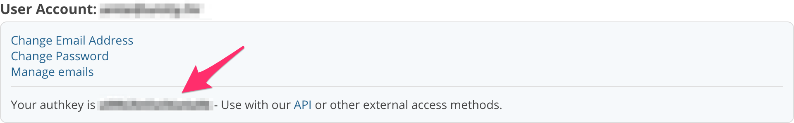

# CrossBrowserTesting Tunnel [](https://travis-ci.org/silvenon/cbt-tunnel)

> Create a [Local Connection][1] for the CrossBrowserTesting app. This is a wrapper around `cbttunnel.jar`, it returns a promise so you can actually know when the connection has been established. The project is inspired by [selenium-standalone][2].

[1]: http://crossbrowsertesting.com/faq/how-create-local-connection-command-line
[2]: https://github.com/vvo/selenium-standalone


## Install

```
$ npm install --save cbt-tunnel
```


## Usage

You can pass the authentication key as an option:

```js
import cbtTunnel from 'cbt-tunnel';

cbtTunnel({
  authKey: '<your authkey>'
})
  .then(() => {
    // success
  }, () => {
    // error
  });
```

or an environment variable:

```js
import cbtTunnel from 'cbt-tunnel';

process.env.CBT_AUTH_KEY = '<your authkey>'

cbtTunnel()
  .then(() => {
    // success
  }, () => {
    // error
  });
```

You can find out what your authentication key is by logging into CrossBrowserTesting, clicking "Account" in the navigation bar and choosing "Account" from the dropdown menu.




## API

### cbtTunnel([options])

#### options

##### authKey

Type: `string`  

The authentication key for your CrossBrowserTesting account. It's required to provide it either via this option or the `CBT_AUTH_KEY` environment variable.

##### dir

Type: `string`

If you want to locally test static HTML pages (i.e. not using a local server), you can do so by specifying the path to that directory. [More info][1].

##### proxy

Type: `object`

Uses your computer to connect to a remote proxy server via a public IP address and port number. [More info][2].

###### proxy.ip

Type: `string`

###### proxy.port

Type: `number`

[1]: http://crossbrowsertesting.com/faq/how-does-local-html-files-local-connection-option-work
[2]: http://crossbrowsertesting.com/faq/how-does-internal-web-site-local-connection-option-work


## License

MIT © [Matija Marohnić](http://twin.github.io)
